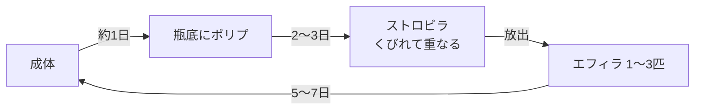

# 海月瓶 企画書

Sep 25, 2026 · @yukina

## コンセプト

暗い部屋の低いテーブルに置いた瓶の中で、海月が勝手に生きている放置ゲーム。暇なときに開いて眺めるだけでいい。閉じている間も実時間で進み、開くたびに何かが少しずつ変わっている。

成功の基準はひとつ。何も操作せずに30秒眺めていられること。

**トーン**：暗く、静かで、遅い。色は黒・ダークグレー・ウォルナット。光源は画面外の窓から入る自然光と、海月自身の発光だけ。

**やらないこと**

- 死亡、枯死、水の汚れなど、放置に対する罰
- 通知で呼び戻すこと
- 通貨、ガチャ、広告、ログインボーナス
- 数値や進捗バーを画面に常駐させること
- 喋る案内役やチュートリアルの吹き出し
- 開いた瞬間に「おかえり」系のポップアップを出すこと。変化は画面を見て気づくもの

## 画面と操作

1画面に瓶1つ。横スワイプで最大3つの瓶を切り替える。縦画面固定。

**初期状態**：1番の瓶にミズクラゲの成体が1匹。2番と3番は水だけ入った空の瓶。空の瓶は、放置中に生まれた個体を移すことで埋まっていく。

**画面に常にあるもの**：瓶、部屋、下端の小さな点3つ（今どの瓶か）、隅の小さなアイコン2つ（餌・日誌）。それ以外は出さない。

| 操作 | 結果 |
| --- | --- |
| 瓶の空いたところをタップ | ガラスをつつく。近くの海月がきゅっと縮んで離れ、数秒かけて緩む |
| 海月をタップ | その個体の小さな札が数秒だけ出る（名前・段階・この瓶に来てからの日数） |
| 餌アイコンをタップ | 水面から少量の餌が沈む。食べた個体はしばらく発光が強まり、成長がわずかに早まる。1瓶につき数時間に1回まで、それ以上は何も落ちない |
| 個体を長押し→左右の端へドラッグ | 隣の瓶へ移す。瓶が上限なら戻る |
| 日誌アイコンをタップ | 観察日誌を開く |
| 左右スワイプ | 瓶の切り替え。スライド中、隣の瓶の光が一瞬重なる |

設定（日誌の奥に置く）：音のオン・オフ、画質3段階、データの書き出し・読み込み。

名前は初期値なし。札に「名無し」と出て、タップで付けられる。

## 放置要素

閉じている間に進むものは5つ。生活環、個体差、光、瓶底に溜まるもの、観察日誌。どれも実時間（端末の時計）基準で、罰はない。

### 1. 生活環

本物のミズクラゲの生活環をなぞる。成体が瓶にいると、瓶底にポリプが付き、それが分裂してエフィラ（稚クラゲ）を放ち、エフィラが育って成体になる。

| 段階 | 見た目 | 期間の目安 |
| --- | --- | --- |
| ポリプ | 瓶底に付いた数mmのイソギンチャク状。触手がゆらぐ | 2〜3日で分裂を始める |
| ストロビラ | ポリプが皿を積み重ねたようにくびれる | 半日〜1日 |
| エフィラ | 星形の小さな傘。拍動が速くぎこちない | 5〜7日で成体へ |
| 成体 | 半透明の傘、四つ葉の生殖腺、短い縁触手 | 寿命なし（老いない） |

期間はすべて `src/config.ts` の定数にまとめ、後で調整できるようにする。餌をやると成長が最大2割ほど早まる。やらなくても止まらない。

**上限**：1瓶あたり遊泳個体（成体＋エフィラ）6匹、ポリプ3つ。上限に達したポリプは休眠し、空きができると再開する。空いている瓶への移動はプレイヤーが手でやる。

### 2. 個体差と変異

各個体は小さな遺伝子を持ち、見た目と動きを決める：傘の色相、透明度、縁の発光色、触手の長さ、拍動のテンポ。エフィラは親の値をわずかにずらして受け継ぐ。何世代か経つと、瓶ごとに色味が偏っていく。

低確率で別種が生まれる。図鑑画面は作らず、日誌に初めて見た日が記録されるだけ。

| 種 | 出現 | 特徴 |
| --- | --- | --- |
| ミズクラゲ | 基本 | 半透明、四つ葉の模様 |
| タコクラゲ | まれ | 茶色がかった丸い傘、太い口腕、ころころ泳ぐ |
| ベニクラゲ | まれ | 小さく赤い芯。成体が一定期間を過ぎると縮んでポリプに戻る |
| カブトクラゲ | ごくまれ | 厳密にはクシクラゲ。拍動せず、体表の櫛板を光が虹色に流れる |

### 3. 光

端末の現地時刻に同期する。窓は画面外で、光だけが横から入る。

- 明け方：青みの弱い光
- 昼：白くて硬い光。海月は透けてほとんど見えない
- 夕方：橙の光がグレーの壁に斜めに当たり、瓶の縁に一瞬だけ温度が乗る
- 夜：窓光はほぼゼロ。海月の発光が主光源になり、瓶が一番きれいな時間
- 3〜4月：窓光がわずかに桃色を帯び、瓶の横に花びらが1枚落ちていることがある

### 4. 瓶底に溜まるもの

マリンスノーが少しずつ瓶底に積もり、うっすら模様になる。一定量で薄く均され、また積もり始める。

まれに小さな拾いもの（貝殻のかけら、シーグラス、小石）が瓶底に現れる。タップすると日誌の標本欄に移る。1瓶に同時に置かれるのは3つまで。

### 5. 観察日誌

閉じていた間の出来事を短い一文で自動記録する。開いたときに押し付けず、日誌アイコンに小さな点が付くだけ。

- 夜のうちにエフィラが二匹離れた
- 三番の瓶のポリプがくびれ始めている
- 明け方、見慣れない赤い個体がいた
- 瓶底でシーグラスを拾った

文体は淡々と。感嘆符や顔文字は使わない。日付ごとにまとまり、標本欄と個体一覧（名前・種・段階・来た日）もここに置く。

## 描画

WebGL2で描く。Canvas 2Dだけでは作らない。背景の部屋だけ写真を使い、海月・瓶・水は形も動きもすべて手続き的に生成する。

### 海月

- **傘**：回転体メッシュを頂点シェーダで変形して拍動させる。縮みは速く、開きはゆっくり（おおよそ 0.3秒で収縮、1.2秒で緩和）。完全に規則的にせず、テンポにわずかな揺らぎを入れる
- **推進**：収縮の瞬間に前へ進み、緩和中はゆっくり沈む。瓶の壁が近づくと向きを緩やかに変える。ぶつからない
- **縁触手**：ばね鎖（verlet）で、傘の動きから遅れてたわむ。本数・長さは遺伝子で決まる
- **口腕**：リボン状で、触手よりさらに遅く重たく揺れる
- **質感**：フレネルで縁が明るく、中心は透けて背景が見える。内側に四つ葉の生殖腺を淡く。厚みの違う層を重ねて奥行きを出す
- **発光**：縁と生殖腺に加算合成、ブルームを弱く。夜ほど目立つ。つつかれた瞬間と餌の後に強まる
- **エフィラとポリプ**：同じ仕組みで形だけ変える。エフィラは8本の腕を持つ星形、ポリプは瓶底で触手がゆらぐだけ

### 瓶

- 円筒形の厚いガラス。縁と側面に細いハイライト
- ガラス越しに背景がわずかに歪む屈折（スクリーン空間）。色ずれはごく弱く
- 水面は瓶の上端近く。下から見上げた揺れる境界がうっすら見える
- 蓋はない

### 水

- 瓶底と海月に落ちるコースティクス（揺れる光の網）。窓光が強い時間ほどはっきり、夜は消える
- マリンスノーの粒子。手前と奥で速さと大きさを変えて視差を出す
- たまに小さな泡が一つ上がる

### 部屋

- **背景写真**：同じ構図で光だけ変えた4枚を使う。昼・夕方・夜、それに桜の季節の昼差分（左上に枝の影が入った版）。桜の桃色は写真に焼き込まず、ゲーム側で壁の明るい部分だけに重ねる。部屋全体には色をかけない。`public/bg/` に置き、WebPかAVIFで長辺2048px前後に変換する
- **構図**：グレーの壁に窓枠の影が斜めに落ち、手前に四角いウォルナットの天板。左奥に積んだ本、右にソファの肘。写真は2:3の縦長で、端末の比率に合わせて左右を切る（cover）
- **瓶の位置**：天板の中央、壁の光の帯の前。昼と夕方は海月が逆光で透ける。位置は写真基準の座標で固定し、画面比率が変わってもずれないようにする
- **ぼかし**：一律にかけない。上（壁）ほど強く、瓶の接地する天板付近は弱く残す。瓶が浮いて見えないように
- **時間の移り変わり**：現地時刻に応じて隣り合う2枚をクロスフェードする。明け方の写真はないので、夜から昼へ移る途中に青みを弱く乗せて作る。切り替えは数十分かけてゆっくり進め、開いている間に気づかない程度にする
- **足すもの**：瓶の接地影、天板へのガラスの映り込み、夜は海月の発光が天板に落ちる照り返し。これらは手続き的に重ねる

### 性能

- 中級スマホで60fpsを目標。デバイスピクセル比は2で頭打ち
- 画質3段階：高（ブルーム・屈折・被写界深度あり）、中（被写界深度なし）、低（ブルーム・屈折なし）
- 描画するのは表示中の瓶だけ。他の瓶はシミュレーションのみ進める
- タブが非表示のときは描画を止める

## 技術要件

Vite＋TypeScript＋three.jsで作り、GitHub ActionsでGitHub Pagesに公開する。PWAとしてホーム画面に置け、オフラインで完全に動くこと。

| 項目 | 内容 |
| --- | --- |
| ビルド | Vite、TypeScript（strict）。`base` をリポジトリ名に合わせる |
| 描画 | three.js＋自作シェーダ。後処理（ブルーム・被写界深度）は three の EffectComposer か自前 |
| 公開 | GitHub Actions で main への push ごとに Pages へデプロイ |
| PWA | manifest（standalone、縦固定、背景色・テーマ色は #111 前後）、アイコン 192・512・maskable。Service Worker で全アセットを事前キャッシュ。更新は次回起動時に反映 |
| 保存 | IndexedDB。瓶・個体（遺伝子・段階・経過時間）・最終保存時刻・日誌・標本・設定を1つの状態として持つ。スキーマ番号とマイグレーションを用意 |
| 書き出し | 状態をJSONで書き出し・読み込みできる（機種変更用） |
| テスト | シミュレーション部分を Vitest で |
| 対象 | iOS Safari（ホーム画面追加）と Android Chrome を優先。セーフエリア対応 |

### 時間とシミュレーション

- シミュレーションは描画から完全に切り離し、`advance(state, 経過秒)` の純関数にする
- 起動時と復帰時（visibilitychange）に、最終保存時刻からの経過分を固定刻み（例：1分）で一気に進める。重ければ刻みを粗くする
- 経過の上限は30日。それ以上離れていても30日分として扱う
- 端末の時計が巻き戻っていたら経過0として扱い、何も壊さない
- 乱数はシード付きにし、同じ状態と経過から同じ結果になるようにする
- 保存は状態変化時と、非表示になる直前

## 実装フェーズとClaude Codeへの渡し方

4段階で作り、各段階の終わりで止めて見た目と手触りを確認してから次へ進む。一番時間をかけるのはフェーズ1。

1. **海月一匹を作り込む**：瓶1つ、ミズクラゲ成体1匹。拍動、触手、質感、発光、瓶のガラス、コースティクス、部屋。光は時刻を手動で切り替えられるデバッグ用スライダーで確認する
2. **時間と保存**：現地時刻との同期、IndexedDB保存、オフライン進行、PWA化、Pagesへのデプロイ
3. **育つ瓶**：生活環（ポリプ・ストロビラ・エフィラ）、3瓶スワイプ、個体の移動、餌、観察日誌
4. **仕上げ**：個体差と変異、レア種3種、拾いもの、桜の季節、音（初期オフ）、画質設定

### 渡し方

- この企画書をMarkdownで書き出し、リポジトリ直下に `SPEC.md` として置く
- `CLAUDE.md` には次を書く：SPEC.mdに従うこと／フェーズごとに止まって確認を取ること／調整用の数値は `src/config.ts` に集めること／デバッグ用に時間を早送りできる隠しパネルを用意すること
- 企画書と実装が食い違う判断が必要になったら、黙って決めずに確認を取らせる

**一緒に渡す画像**：`bg-day.png`（昼）、`bg-sakura.png`（桜の季節の昼）、`bg-dusk.png`（夕方）、`bg-night.png`（夜）、`icon-source.png`（アイコンの元画像、正方形）。WebP化と各サイズのアイコン生成はビルド時か手作業で行う。

### 未決

- ゲームのタイトル（仮：海月瓶）
- 音を入れるなら何の音か（水の揺れ、部屋の空気、なし）
